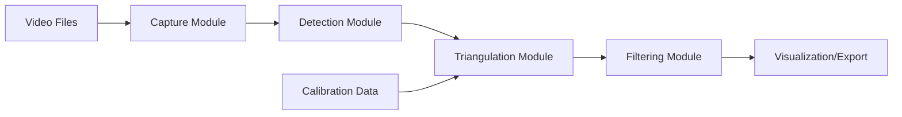

# System Architecture

## Overview
The Advanced Mixed-Camera Pose Estimation pipeline is designed to process pre-recorded video footage from a multi-camera setup to generate accurate 3D human pose data. The system operates in an offline manner, prioritizing accuracy and robustness over real-time performance.

## Pipeline Stages

### 1. Data Ingestion (`capture.py`)
- **Input**: Synchronized video files from 3 cameras (1 Fisheye, 2 Standard).
- **Function**: Reads frames sequentially, ensuring frame alignment across all sources.
- **Output**: Synchronized frameset for processing.

### 2. 2D Pose Detection (`detection.py`)
- **Input**: Individual frames.
- **Model**: YOLOv8 (or similar state-of-the-art pose estimator).
- **Function**: Detects human keypoints in 2D image space.
- **Fisheye Handling**: 
    - Standard cameras: Direct inference.
    - Fisheye camera: Inference on distorted images (Phase 0) or undistorted regions (Phase 1).

### 3. Multi-View Triangulation (`triangulation.py`)
- **Input**: 2D keypoints from multiple views, Camera Intrinsics & Extrinsics.
- **Function**: 
    - Undistorts 2D points using camera calibration data.
    - Solves for 3D coordinates using Direct Linear Transformation (DLT) or similar algorithms.
    - Handles missing points from occluded views.
- **Output**: Raw 3D keypoints.

### 4. Temporal Filtering (`filtering.py`)
- **Input**: Sequence of raw 3D keypoints.
- **Function**: Applies OneEuro or Kalman filtering to smooth jitter and reduce noise.
- **Output**: Smooth, temporally consistent 3D pose trajectories.

### 5. Visualization & Export (`tools/visualize_3d_output.py`)
- **Function**: Generates 3D plots and overlays for verification.
- **Output**: 3D animation files, CSV logs of keypoints.

## Data Flow

